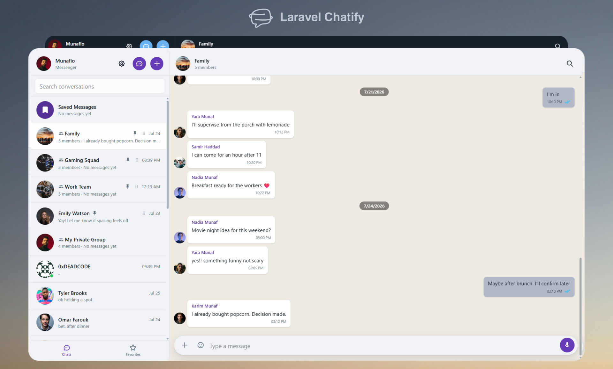

  

  
  
  
  

  A real-time chat package for Laravel. 
  Direct messages, group conversations, typing indicators, attachments, and more — installable with a single Artisan command.

  <a href="https://chatifyphp.com/docs"><strong>Documentation</strong></a> &nbsp;&bull;&nbsp;
  <a href="https://github.com/munafio/chatify-v2-demo"><strong>Demo App</strong></a> &nbsp;&bull;&nbsp;
  <a href="https://discord.gg/RaxyKVykYJ"><strong>Discord</strong></a> &nbsp;&bull;&nbsp;
  <a href="https://github.com/munafio/chatify/releases"><strong>Releases</strong></a>

---

> **v2 is in beta.** Install with `composer require munafio/chatify:^2.0@beta`.
> v1 remains stable on `^1.6`. See the [Upgrading Guide](https://chatifyphp.com/docs/upgrading) for details.

## Features

- **Direct messages** between any two authenticated users
- **Group conversations** with roles, permissions, and participant management
- **Saved messages** — Telegram-style self-chat for bookmarks and notes
- **Real-time** typing indicators, read receipts, and presence (online/offline)
- **Attachments** — images, documents, audio, video with configurable size limits
- **Reply, edit, delete, and forward** messages
- **Voice notes** recording and playback
- **Favorites** and **blocking** system
- **Message search** within conversations
- **Giphy stickers** and **link previews**
- **Themes, fonts, colors, and wallpaper** — all user-configurable
- **Localization** with RTL support (English and Arabic included)
- **Bundled messenger UI** (Vue 3 + Pinia + Tailwind CSS) served at `/chatify`
- **Headless JSON API** for custom frontends (SPA, mobile, etc.)
- **Gravatar** integration for default avatars

...and much more!

## Requirements

| Dependency | Version |
| --- | --- |
| PHP | 8.2+ |
| Laravel | 11+|
| Broadcasting | Pusher, Laravel Reverb, or compatible WebSocket server |

## Documentation

Full documentation is available at **[chatifyphp.com/docs](https://chatifyphp.com/docs)** — covering installation, configuration, groups, API reference, broadcasting setup, customization, and more.

## Demo

| Resource | Link |
| --- | --- |
| Demo application | [munafio/chatify-v2-demo](https://github.com/munafio/chatify-v2-demo) |
| Video walkthrough | [YouTube](https://www.youtube.com/watch?v=eOeYFa0zkj0) |

## Community

Join the [Discord server](https://discord.gg/RaxyKVykYJ) for help, announcements, showcases, and discussion.

## Contributing

Contributions are welcome. Please see the [contributing guide](CONTRIBUTING.md) for details.

## Security

If you discover a security vulnerability, please report it via the [GitHub Security Policy](https://github.com/munafio/chatify/security). Do not open a public issue.

## License

Chatify is open-source software licensed under the [MIT License](LICENSE).

## Author

[Munaf A. Mahdi](https://www.munafio.com)
